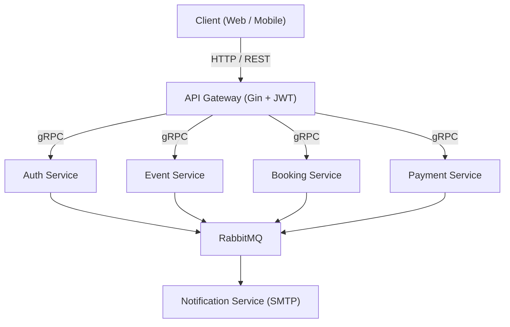

<!-- Improved compatibility of back to top link: See: https://github.com/othneildrew/Best-README-Template/pull/73 -->

<a id="readme-top"></a>

[![Go][go-badge]][go-url] [![Gin][gin-badge]][gin-url]
[![gRPC][grpc-badge]][grpc-url] [![PostgreSQL][postgres-badge]][postgres-url]
[![RabbitMQ][rabbitmq-badge]][rabbitmq-url]
[![Stripe][stripe-badge]][stripe-url] [![Docker][docker-badge]][docker-url]
[![Kubernetes][k8s-badge]][k8s-url]

# E-Ticket

E-Ticket is a microservices-based ticketing platform built with Go. It provides
user authentication, event discovery, bookings, Stripe payments, and email
notifications through a REST API gateway backed by gRPC services and RabbitMQ.

- Docs: `docs/`
- Architecture diagram: `docs/architecture.md`
- Flow diagrams: `docs/flows/`

<!-- TABLE OF CONTENTS -->
<details>
  <summary>Table of Contents</summary>
  <ol>
    <li>
      <a href="#about-the-project">About The Project</a>
      <ul>
        <li><a href="#built-with">Built With</a></li>
      </ul>
    </li>
    <li>
      <a href="#getting-started">Getting Started</a>
      <ul>
        <li><a href="#prerequisites">Prerequisites</a></li>
        <li><a href="#installation">Installation</a></li>
      </ul>
    </li>
    <li><a href="#usage">Usage</a></li>
    <li><a href="#roadmap">Roadmap</a></li>
    <li><a href="#contributing">Contributing</a></li>
    <li><a href="#license">License</a></li>
    <li><a href="#contact">Contact</a></li>
    <li><a href="#acknowledgments">Acknowledgments</a></li>
  </ol>
</details>

<!-- ABOUT THE PROJECT -->

## About The Project

The system is composed of an API Gateway and multiple services (auth, event,
booking, payment, notification) that communicate via gRPC and publish events to
RabbitMQ. PostgreSQL stores service data, while the notification service handles
activation emails. Stripe is used for payment sessions and webhook
confirmations.



<p align="right">(<a href="#readme-top">back to top</a>)</p>

### Built With

- [![Go][go-badge]][go-url]
- [![Gin][gin-badge]][gin-url]
- [![gRPC][grpc-badge]][grpc-url]
- [![PostgreSQL][postgres-badge]][postgres-url]
- [![RabbitMQ][rabbitmq-badge]][rabbitmq-url]
- [![Stripe][stripe-badge]][stripe-url]
- [![Docker][docker-badge]][docker-url]
- [![Kubernetes][k8s-badge]][k8s-url]
- [![Tilt][tilt-badge]][tilt-url]

<p align="right">(<a href="#readme-top">back to top</a>)</p>

<!-- GETTING STARTED -->

## Getting Started

Follow these steps to get a local development environment running with Tilt and
Kubernetes.

### Prerequisites

- Go 1.25+
- Docker Desktop (or another Docker runtime)
- Kubernetes (Docker Desktop, Kind, or Minikube)
- `kubectl`
- Tilt
- Protocol Buffers compiler (`protoc`)
- `migrate` CLI (golang-migrate) for database migrations

### Installation

1. Clone the repo
   ```sh
   git clone https://github.com/baobei23/e-ticket.git
   ```
2. Download Go modules
   ```sh
   go mod download
   ```
3. Update secrets for development (Stripe, SMTP, RabbitMQ, DB)
   - Edit `infra/development/k8s/secrets.yaml` with your own credentials.
4. Start the dev stack with Tilt
   ```sh
   tilt up
   ```
5. Apply migrations (optional when running services locally)
   ```sh
   make migrate-up
   ```

<p align="right">(<a href="#readme-top">back to top</a>)</p>

<!-- USAGE EXAMPLES -->

## Usage

Once Tilt is running, the API Gateway is available on `http://localhost:8080`.

Key endpoints:

- `GET /health`
- `GET /events?page&limit`
- `GET /events/:id`
- `GET /events/:id/check?quantity=2`
- `POST /auth/register`
- `PUT /auth/activate/:token`
- `POST /auth/login`
- `POST /bookings` (requires `Authorization: Bearer <token>`)
- `GET /booking/:id` (requires `Authorization: Bearer <token>`)
- `POST /stripe/webhook`

Example:

```sh
curl -X POST http://localhost:8080/auth/register \
  -H "Content-Type: application/json" \
  -d '{"email":"user@example.com","password":"secret123"}'
```

For detailed flow diagrams, see `docs/flows/`.

<p align="right">(<a href="#readme-top">back to top</a>)</p>

<!-- ROADMAP -->

## Roadmap

- [ ] Add a frontend UI
- [ ] Add observability (metrics, tracing, dashboards)
- [ ] Add role-based access control

See the [open issues](https://github.com/baobei23/e-ticket/issues) for a full
list of proposed features (and known issues).

<p align="right">(<a href="#readme-top">back to top</a>)</p>

<!-- CONTRIBUTING -->

## Contributing

Contributions are what make the open source community such an amazing place to
learn, inspire, and create. Any contributions you make are **greatly
appreciated**.

If you have a suggestion that would make this better, please fork the repo and
create a pull request. You can also simply open an issue with the tag
"enhancement". Don't forget to give the project a star! Thanks again!

1. Fork the Project
2. Create your Feature Branch (`git checkout -b feature/AmazingFeature`)
3. Commit your Changes (`git commit -m 'Add some AmazingFeature'`)
4. Push to the Branch (`git push origin feature/AmazingFeature`)
5. Open a Pull Request

<p align="right">(<a href="#readme-top">back to top</a>)</p>

### Top contributors:

<a href="https://github.com/github_username/repo_name/graphs/contributors">
  
</a>

<!-- LICENSE -->

## License

No license has been specified yet. Add a `LICENSE` file to define usage terms.

<p align="right">(<a href="#readme-top">back to top</a>)</p>

<!-- CONTACT -->

## Contact

Project Link:
[https://github.com/baobei23/e-ticket](https://github.com/baobei23/e-ticket)

For questions or issues, please open a GitHub issue.

<p align="right">(<a href="#readme-top">back to top</a>)</p>

<!-- ACKNOWLEDGMENTS -->

## Acknowledgments

- [Gin](https://github.com/gin-gonic/gin)
- [gRPC](https://grpc.io/)
- [RabbitMQ](https://www.rabbitmq.com/)
- [Stripe](https://stripe.com/)
- [Mermaid](https://mermaid.js.org/)

<p align="right">(<a href="#readme-top">back to top</a>)</p>

<!-- MARKDOWN LINKS & IMAGES -->
<!-- https://www.markdownguide.org/basic-syntax/#reference-style-links -->

<!-- Shields.io badges. You can find more at: https://github.com/inttter/md-badges -->

[go-badge]:
  https://img.shields.io/badge/Go-00ADD8?style=for-the-badge&logo=go&logoColor=white
[go-url]: https://go.dev/
[gin-badge]:
  https://img.shields.io/badge/Gin-008ECF?style=for-the-badge&logo=go&logoColor=white
[gin-url]: https://github.com/gin-gonic/gin
[grpc-badge]:
  https://img.shields.io/badge/gRPC-1A73E8?style=for-the-badge&logo=grpc&logoColor=white
[grpc-url]: https://grpc.io/
[postgres-badge]:
  https://img.shields.io/badge/PostgreSQL-4169E1?style=for-the-badge&logo=postgresql&logoColor=white
[postgres-url]: https://www.postgresql.org/
[rabbitmq-badge]:
  https://img.shields.io/badge/RabbitMQ-FF6600?style=for-the-badge&logo=rabbitmq&logoColor=white
[rabbitmq-url]: https://www.rabbitmq.com/
[stripe-badge]:
  https://img.shields.io/badge/Stripe-635BFF?style=for-the-badge&logo=stripe&logoColor=white
[stripe-url]: https://stripe.com/
[docker-badge]:
  https://img.shields.io/badge/Docker-2496ED?style=for-the-badge&logo=docker&logoColor=white
[docker-url]: https://www.docker.com/
[k8s-badge]:
  https://img.shields.io/badge/Kubernetes-326CE5?style=for-the-badge&logo=kubernetes&logoColor=white
[k8s-url]: https://kubernetes.io/
[tilt-badge]:
  https://img.shields.io/badge/Tilt-00C8A8?style=for-the-badge&logo=tilt&logoColor=white
[tilt-url]: https://tilt.dev/
