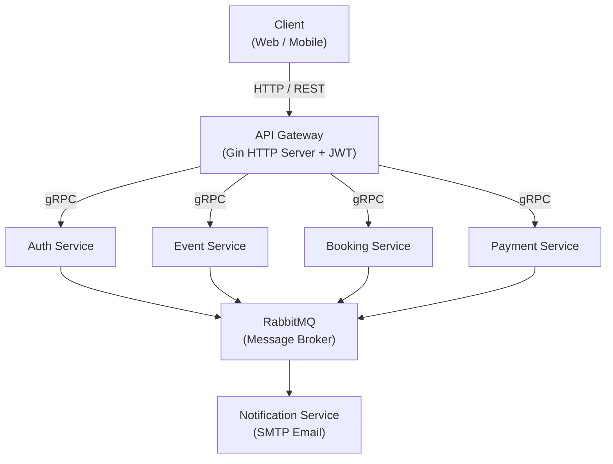

```mermaid
flowchart TB
    Client["Client
(Web / Mobile)"]

    APIGW["API Gateway
(Gin HTTP Server + JWT)"]

    Auth["Auth Service"]
    Event["Event Service"]
    Booking["Booking Service"]
    Payment["Payment Service"]

    MQ["RabbitMQ
(Message Broker)"]

    Notif["Notification Service
(SMTP Email)"]

    %% Client to API Gateway
    Client -->|HTTP / REST| APIGW

    %% API Gateway to Services (gRPC)
    APIGW -->|gRPC| Auth
    APIGW -->|gRPC| Event
    APIGW -->|gRPC| Booking
    APIGW -->|gRPC| Payment

    %% Services to RabbitMQ
    Auth --> MQ
    Event --> MQ
    Booking --> MQ
    Payment --> MQ

    %% RabbitMQ to Notification Service
    MQ --> Notif
```
