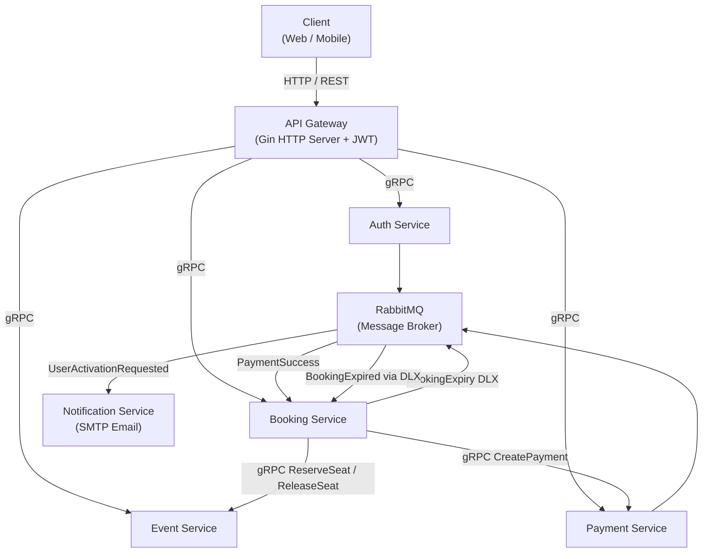

```mermaid
flowchart TB
    Client["Client
(Web / Mobile)"]
    APIGW["API Gateway
(Gin HTTP Server + JWT)"]
    Auth["Auth Service"]
    Event["Event Service"]
    Booking["Booking Service"]
    Payment["Payment Service"]
    MQ["RabbitMQ
(Message Broker)"]
    Notif["Notification Service
(SMTP Email)"]
    %% Client to API Gateway
    Client -->|HTTP / REST| APIGW
    %% API Gateway to Services (gRPC)
    APIGW -->|gRPC| Auth
    APIGW -->|gRPC| Event
    APIGW -->|gRPC| Booking
    APIGW -->|gRPC| Payment
    %% Inter-service gRPC
    Booking -->|gRPC ReserveSeat / ReleaseSeat| Event
    Booking -->|gRPC CreatePayment| Payment
    %% Services to RabbitMQ
    Auth --> MQ
    Booking -->|BookingExpiry DLX| MQ
    Payment --> MQ
    %% RabbitMQ consumers
    MQ -->|UserActivationRequested| Notif
    MQ -->|PaymentSuccess| Booking
    MQ -->|BookingExpired via DLX| Booking
```
