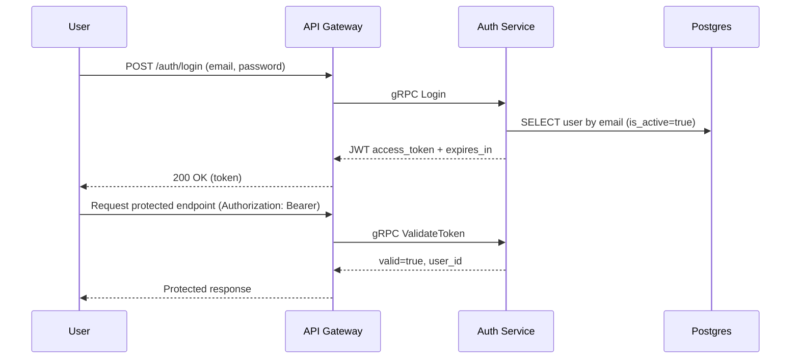

## Auth Login + Validate Token

```mermaid
sequenceDiagram
  participant User as User
  participant APIGW as API Gateway
  participant Auth as Auth Service
  participant DB as Postgres

  User ->> APIGW: POST /auth/login (email, password)
  APIGW ->> Auth: gRPC Login
  Auth ->> DB: SELECT user by email (is_active=true)
  Auth -->> APIGW: JWT access_token + expires_in
  APIGW -->> User: 200 OK (token)

  User ->> APIGW: Request protected endpoint (Authorization: Bearer)
  APIGW ->> Auth: gRPC ValidateToken
  Auth -->> APIGW: valid=true, user_id
  APIGW -->> User: Protected response
```
