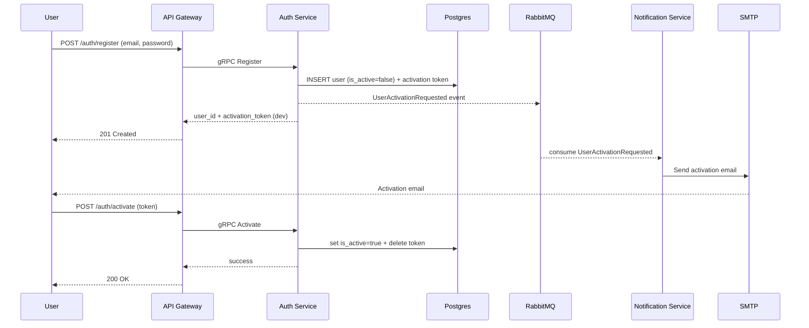

## Auth Register + Activation

```mermaid
sequenceDiagram
  participant User as User
  participant APIGW as API Gateway
  participant Auth as Auth Service
  participant DB as Postgres
  participant MQ as RabbitMQ
  participant Notif as Notification Service
  participant SMTP as SMTP

  User ->> APIGW: POST /auth/register (email, password)
  APIGW ->> Auth: gRPC Register
  Auth ->> DB: INSERT user (is_active=false) + activation token
  Auth -->> MQ: UserActivationRequested event
  Auth -->> APIGW: user_id + activation_token (dev)
  APIGW -->> User: 201 Created

  MQ -->> Notif: consume UserActivationRequested
  Notif ->> SMTP: Send activation email
  SMTP -->> User: Activation email

  User ->> APIGW: POST /auth/activate (token)
  APIGW ->> Auth: gRPC Activate
  Auth ->> DB: set is_active=true + delete token
  Auth -->> APIGW: success
  APIGW -->> User: 200 OK
```
