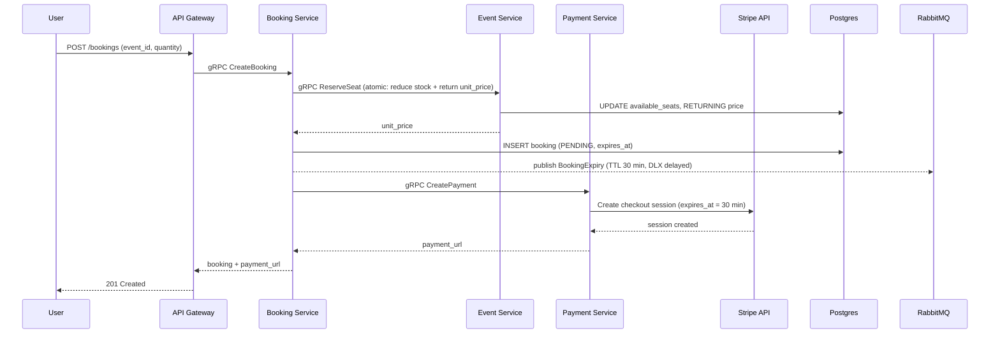

## Create Booking + Payment Session

```mermaid
sequenceDiagram
  participant User as User
  participant APIGW as API Gateway
  participant Booking as Booking Service
  participant Event as Event Service
  participant Payment as Payment Service
  participant Stripe as Stripe API
  participant DB as Postgres
  participant MQ as RabbitMQ

  User ->> APIGW: POST /bookings (event_id, quantity)
  APIGW ->> Booking: gRPC CreateBooking

  Booking ->> Event: gRPC ReserveSeat (atomic: reduce stock + return unit_price)
  Event ->> DB: UPDATE available_seats, RETURNING price
  Event -->> Booking: unit_price

  Booking ->> DB: INSERT booking (PENDING, expires_at)
  Booking -->> MQ: publish BookingExpiry (TTL 30 min, DLX delayed)

  Booking ->> Payment: gRPC CreatePayment
  Payment ->> Stripe: Create checkout session (expires_at = 30 min)
  Stripe -->> Payment: session created
  Payment -->> Booking: payment_url

  Booking -->> APIGW: booking + payment_url
  APIGW -->> User: 201 Created
```
