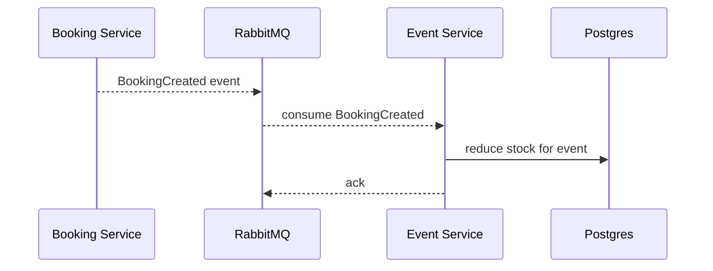

## Booking Created -> Event Stock Update

```mermaid
sequenceDiagram
  participant Booking as Booking Service
  participant MQ as RabbitMQ
  participant Event as Event Service
  participant DB as Postgres

  Booking -->> MQ: BookingCreated event
  MQ -->> Event: consume BookingCreated
  Event ->> DB: reduce stock for event
  Event -->> MQ: ack
```
