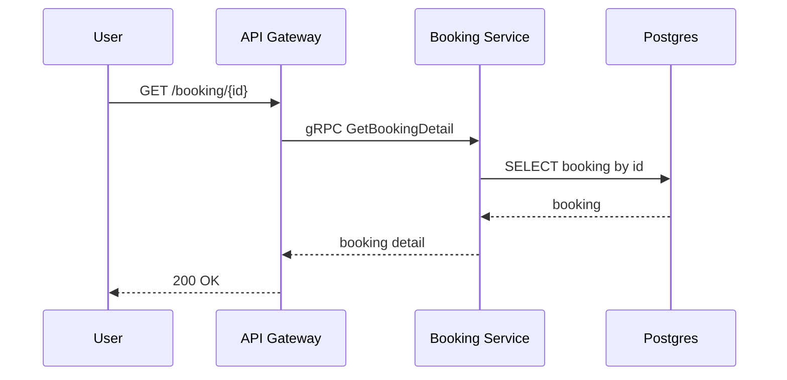

## Booking Detail

```mermaid
sequenceDiagram
  participant User as User
  participant APIGW as API Gateway
  participant Booking as Booking Service
  participant DB as Postgres

  User ->> APIGW: GET /booking/{id}
  APIGW ->> Booking: gRPC GetBookingDetail
  Booking ->> DB: SELECT booking by id
  DB -->> Booking: booking
  Booking -->> APIGW: booking detail
  APIGW -->> User: 200 OK
```
