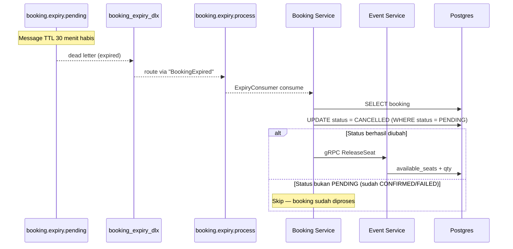

## Booking Expiry (Auto-Cancel via DLX)

Jika user tidak menyelesaikan pembayaran dalam 30 menit, booking otomatis
dibatalkan dan stok dikembalikan.

### Mekanisme

1. Saat booking dibuat, message `BookingExpiry` dikirim ke queue
   `booking.expiry.pending` dengan per-message TTL 30 menit.
2. Queue ini **tidak memiliki consumer** — message hanya "tidur" sampai TTL
   habis.
3. Setelah TTL habis, RabbitMQ memindahkan message ke `booking_expiry_dlx` (Dead
   Letter Exchange).
4. DLX merouting message ke queue `booking.expiry.process`.
5. `ExpiryConsumer` di booking-service memproses message.

### Flow

