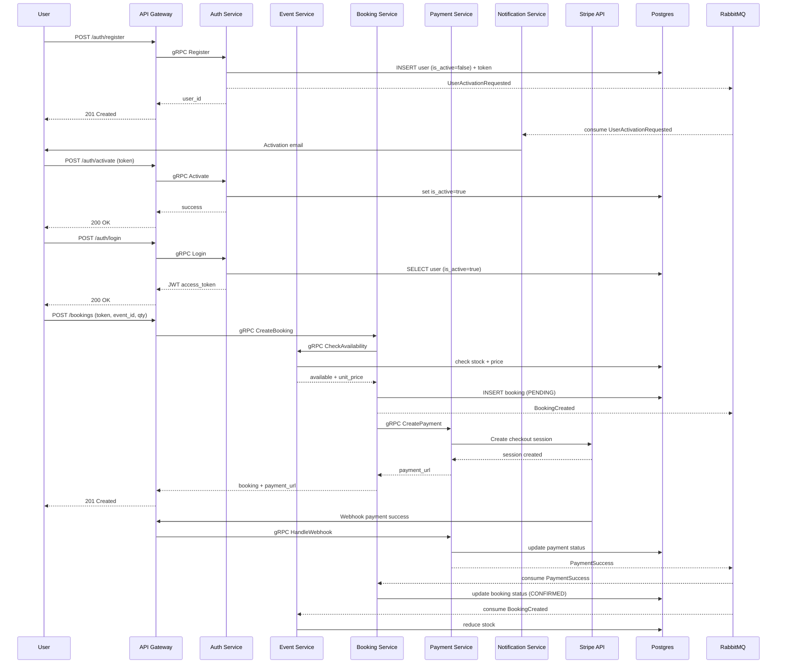

## End-to-End Booking Flow (Register → Booking → Payment → Confirmed)

```mermaid
sequenceDiagram
  participant User as User
  participant APIGW as API Gateway
  participant Auth as Auth Service
  participant Event as Event Service
  participant Booking as Booking Service
  participant Payment as Payment Service
  participant Notif as Notification Service
  participant Stripe as Stripe API
  participant DB as Postgres
  participant MQ as RabbitMQ

  User ->> APIGW: POST /auth/register
  APIGW ->> Auth: gRPC Register
  Auth ->> DB: INSERT user (is_active=false) + token
  Auth -->> MQ: UserActivationRequested
  Auth -->> APIGW: user_id
  APIGW -->> User: 201 Created

  MQ -->> Notif: consume UserActivationRequested
  Notif ->> User: Activation email

  User ->> APIGW: POST /auth/activate (token)
  APIGW ->> Auth: gRPC Activate
  Auth ->> DB: set is_active=true
  Auth -->> APIGW: success
  APIGW -->> User: 200 OK

  User ->> APIGW: POST /auth/login
  APIGW ->> Auth: gRPC Login
  Auth ->> DB: SELECT user (is_active=true)
  Auth -->> APIGW: JWT access_token
  APIGW -->> User: 200 OK

  User ->> APIGW: POST /bookings (token, event_id, qty)
  APIGW ->> Booking: gRPC CreateBooking
  Booking ->> Event: gRPC CheckAvailability
  Event ->> DB: check stock + price
  Event -->> Booking: available + unit_price
  Booking ->> DB: INSERT booking (PENDING)
  Booking -->> MQ: BookingCreated
  Booking ->> Payment: gRPC CreatePayment
  Payment ->> Stripe: Create checkout session
  Stripe -->> Payment: session created
  Payment -->> Booking: payment_url
  Booking -->> APIGW: booking + payment_url
  APIGW -->> User: 201 Created

  Stripe ->> APIGW: Webhook payment success
  APIGW ->> Payment: gRPC HandleWebhook
  Payment ->> DB: update payment status
  Payment -->> MQ: PaymentSuccess

  MQ -->> Booking: consume PaymentSuccess
  Booking ->> DB: update booking status (CONFIRMED)

  MQ -->> Event: consume BookingCreated
  Event ->> DB: reduce stock
```
