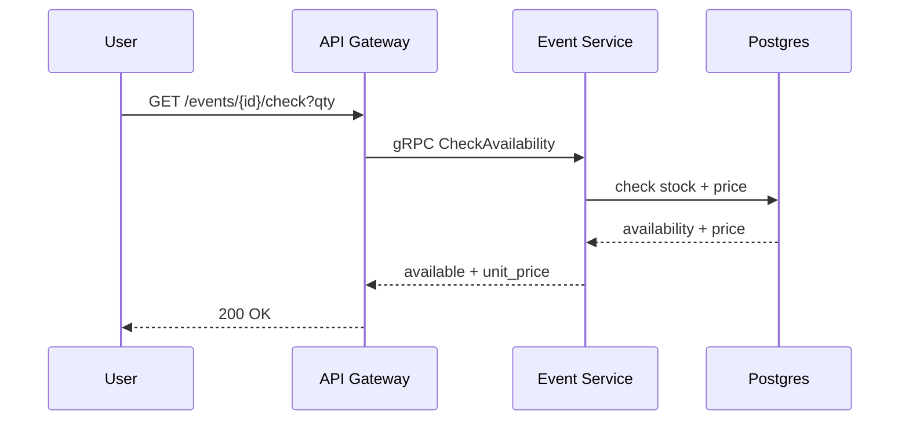

## Event Check Availability

```mermaid
sequenceDiagram
  participant User as User
  participant APIGW as API Gateway
  participant Event as Event Service
  participant DB as Postgres

  User ->> APIGW: GET /events/{id}/check?qty
  APIGW ->> Event: gRPC CheckAvailability
  Event ->> DB: check stock + price
  DB -->> Event: availability + price
  Event -->> APIGW: available + unit_price
  APIGW -->> User: 200 OK
```
