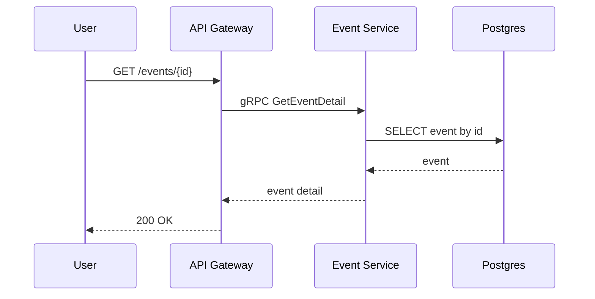

## Event Detail

```mermaid
sequenceDiagram
  participant User as User
  participant APIGW as API Gateway
  participant Event as Event Service
  participant DB as Postgres

  User ->> APIGW: GET /events/{id}
  APIGW ->> Event: gRPC GetEventDetail
  Event ->> DB: SELECT event by id
  DB -->> Event: event
  Event -->> APIGW: event detail
  APIGW -->> User: 200 OK
```
