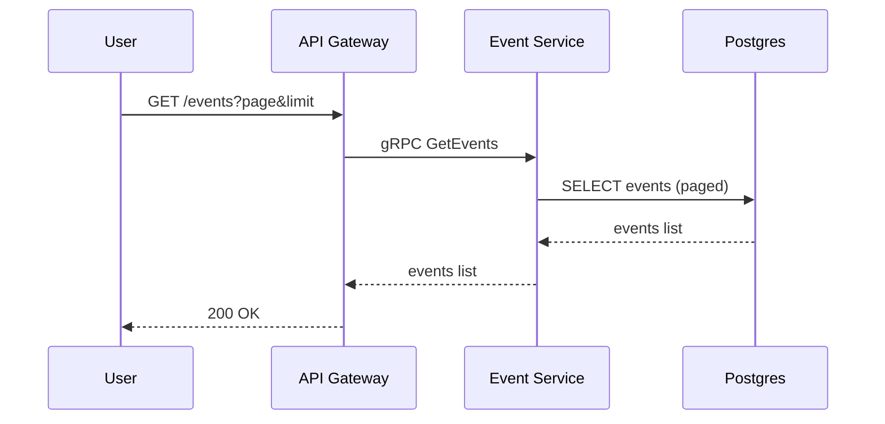

## Event List

```mermaid
sequenceDiagram
  participant User as User
  participant APIGW as API Gateway
  participant Event as Event Service
  participant DB as Postgres

  User ->> APIGW: GET /events?page&limit
  APIGW ->> Event: gRPC GetEvents
  Event ->> DB: SELECT events (paged)
  DB -->> Event: events list
  Event -->> APIGW: events list
  APIGW -->> User: 200 OK
```
