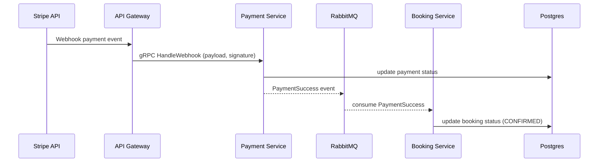

## Payment Webhook + Booking Confirmation

```mermaid
sequenceDiagram
  participant Stripe as Stripe API
  participant APIGW as API Gateway
  participant Payment as Payment Service
  participant MQ as RabbitMQ
  participant Booking as Booking Service
  participant DB as Postgres

  Stripe ->> APIGW: Webhook payment event
  APIGW ->> Payment: gRPC HandleWebhook (payload, signature)
  Payment ->> DB: update payment status
  Payment -->> MQ: PaymentSuccess event

  MQ -->> Booking: consume PaymentSuccess
  Booking ->> DB: update booking status (CONFIRMED)
```
