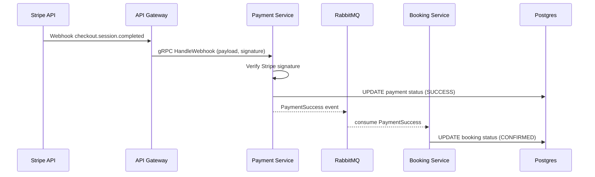

## Payment Webhook + Booking Confirmation

```mermaid
sequenceDiagram
  participant Stripe as Stripe API
  participant APIGW as API Gateway
  participant Payment as Payment Service
  participant MQ as RabbitMQ
  participant Booking as Booking Service
  participant DB as Postgres
  Stripe ->> APIGW: Webhook checkout.session.completed
  APIGW ->> Payment: gRPC HandleWebhook (payload, signature)
  Payment ->> Payment: Verify Stripe signature
  Payment ->> DB: UPDATE payment status (SUCCESS)
  Payment -->> MQ: PaymentSuccess event
  MQ -->> Booking: consume PaymentSuccess
  Booking ->> DB: UPDATE booking status (CONFIRMED)
```
